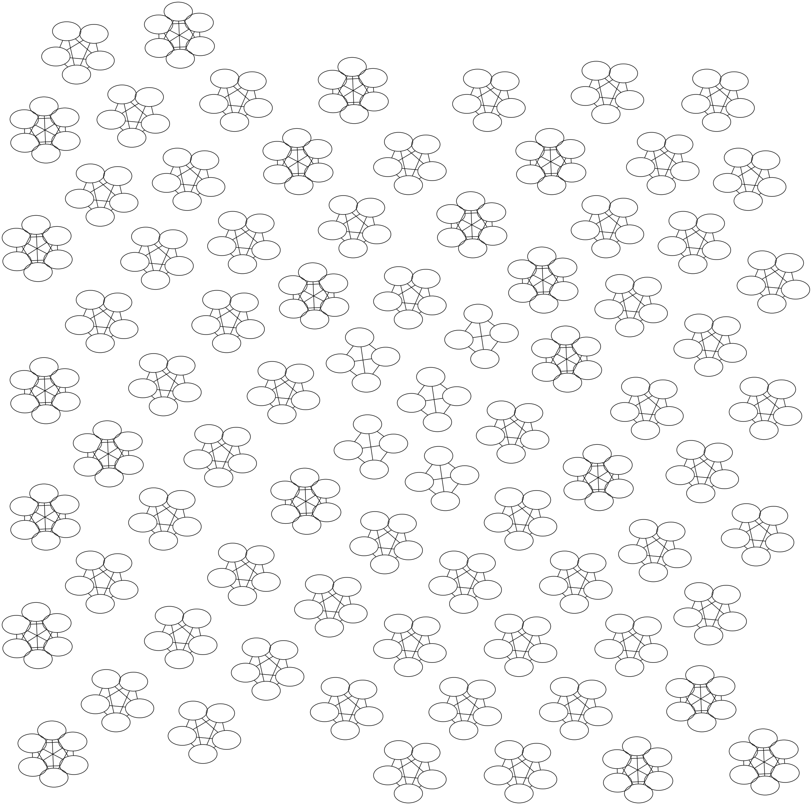

# Amigos

**A SUTDy of teammate retention rate for SUTD's Class of 2022.**

<a href="https://github.com/psf/black"></a>

Just a simple weekend project that I came up with for exploration and fun purposes.

This short study utilizes graph theory to compare group member composition between the courses **[03.007 Introduction to Design](https://smt.sutd.edu.sg/education/undergraduate/courses/03007-introduction-design)** and **[10.009 The Digital World](https://smt.sutd.edu.sg/education/undergraduate/courses/10009-digital-world)**.

A final measure in the form of teammate retention rate is then calculated.

## Why 03.007 & 10.009?

The numbers? I don't know, I didn't came up with the course codes.

The courses? 03.007 because it is the first major general whole-cohort/batch course in a SUTDent's journey that allows free choosing of teammates. 10.009 because it is the second major course in the current Freshmore Curriculum that allows free choosing of teammates (and it is just after 03.007, since 03.007 was conducted on Term 2 and 10.009 was conducted on Term 3). Hence, that's why I am ignoring other 1D and/or 2D group formation instances (whether auto-formed or self-formed).

Also, a major factor to choosing these courses would be that the data of groups formed were made available by the respective faculty members internally to the Freshmores (I am quite sure that it was more on the unintentional side).

> DISCLAIMER: This study is fairly inapplicable for batches of SUTDents from AY2020 onwards since the university decided to revamp and change the whole Freshmore curriculum, thereby switching the order of the courses (**[Design Thinking and Innovation](https://smt.sutd.edu.sg/education/undergraduate/courses/design-thinking-and-innovation)** is the 03.007-equivalent, conducted on Term 2, and **[Computational Thinking for Design](https://smt.sutd.edu.sg/education/undergraduate/courses/computational-thinking-for-design)** is the 10.009-equivalent, conducted on Term 1). Although, some minor slight parallels could definitely be derived if several major assumptions were to be made (one of which being that voluntary group-making could even take place/is allowed for the 1D projects of both courses).

## Repository Details & Usage

> To install the dependencies properly, this command might need to be run first beforehand: `sudo apt install python3-testresources`

No actual data is included in this repository so as to comply with the current PDPA guidelines and legislations adopted by SUTD in Singapore (although the results recorded below are drawn from the actual data).

Each person is considered to be a node/vertex in the 2 group composition graphs, each representing each module. If two persons are in the same group for either subject, they would then be connected by an undirected edge (resulting in two adjacent vertices being incident to an undirected edge). This would result in 2 simple (non-multigraph), undirected and unweighted graphs being formed, one for each module (and they are definitely cyclic since complete subgraphs contain loops/cycles). Then, analysis was done using methods involving the Graph Edit Distance between the two graphs formed. Using `networkx` and `gmatch4py`, we calculated the (bidirectional) Graph Edit Distance as a measure of similarity between the two graphs. This measure would then be converted/normalized into a percentage form to give a more intuitive and concrete measure on how similar the two graphs are, thereby resulting in the desired teammate retention rate figure. To get the teammate retention rate, we relatively compare against two types of graph candidates: the respective empty graphs and the corresponding complement graphs. This is to give a more rounded and nuanced approach to the final estimate. Finally, as a control variable, we check the "similarity rate" against the null graph (empty graph with zero nodes) as well.

> `gmatch4py` was used so as to not re-invent the wheel and to improve performance (since it is using Cython). Since it is not published on the Python Package Index (PyPI) at the moment of writing, we would need to clone the [GitHub repository](https://github.com/Jacobe2169/GMatch4py) and install it manually by ourselves. Since it is not yet officially supported on Windows currently (not tested based on [this issue](https://github.com/Jacobe2169/GMatch4py/issues/22), although some Cython-related compatibility issues could potentially be resolved by exploring [this page](https://github.com/cython/cython/wiki/InstallingOnWindows) and [this page](https://github.com/cython/cython/wiki/CythonExtensionsOnWindows) in the future), we would need to install `gmatch4py` on either Linux or MacOS. We would also need to install [this Python wrapper](https://github.com/jfrelinger/cython-munkres-wrapper) as well, since it will perform much faster than its `scipy.optimize.linear_sum_assignment` counterpart (based on [this issue](https://github.com/Jacobe2169/GMatch4py/issues/10)). I have included both in the corresponding `requirements.txt` file. The cost matrices produced by `gmatch4py` greatly assisted and helped us in writing cleaner code, since they automatically provide the calculated bidirectional graph edit distances. We utilized the raw cost matrices and then proceeded to convert them manually instead of using the normalized matrices since we require the raw values to compute our teammate retention rate. The reason for this is that, intuitively, a larger edit distance should imply a lower similarity rate, even if both directions have the same edit distance.

Scripts are provided [here](./scripts) and sample data format are provided [here](./data). Please be patient with the main GED-based algorithm, since this is an NP-hard problem and thus it would take quite some computational time (even if it is already optimized so as to take polynomial time by converting it to an Assignment problem first).

> Sample data has been pre-processed and sanitized, and as such, is the post-processed, well-prepared, uniform and formatted sample data. Actual data has a few minor issues that would need to be fixed in order for the scripts to process them correctly. Before running the corresponding scripts that contain and execute any scraping jobs, ensure that an Internet connection is available since the scripts need to scrape from online data sources.

For data access, follow these steps:

1. For 03.007 groupings, eDimension credentials and access to the AY2019 03.007 course page (course code: 1930-030007) would be required. Navigate to the 03.007 course link's homepage and a link to the class photo roster should be available there. The tabular data in its full HTML-format glory (formatted as a viewable accordion on the eDimension page) would then be scraped via `scrapy`. We utilized `scrapy` instead of `beautifulsoup4` since `scrapy` is much more performant when handling large amount of data. However, since `scrapy` itself cannot handle JavaScript pages, and since we require some button-clicking and logging in to some forms for the eDimension page, we would employ `selenium` to handle that role. Since the script requires `selenium`, at least one of the Selenium-compatible [browsers](https://www.selenium.dev/documentation/en/getting_started_with_webdriver/browsers/)/[drivers](https://www.selenium.dev/documentation/en/webdriver/driver_requirements/) is also needed. This project specifically uses `geckodriver`, but the script is modifiable so as to use other drivers such as `chromedriver`. Follow [these steps](https://docs.scrapy.org/en/latest/intro/install.html) to properly install `scrapy`. If a `RequestGenerationFailed`/`AttributeError` issue is encountered on Ubuntu, read the [Troubleshooting section](https://docs.scrapy.org/en/latest/intro/install.html#troubleshooting) for a potential fix. Other middleware options that could be considered in the future would be [`scrapy-selenium`](https://github.com/clemfromspace/scrapy-selenium) (this template is similar to this project's homemade built-in custom spider method) or [`scrapy-splash`](https://github.com/scrapy-plugins/scrapy-splash) (this requires the usage of an additional middleware called [Splash](https://github.com/scrapinghub/splash)).
2. For 10.009 groupings (course code: 2010-100009), direct access to the Google Sheets key would be needed. Even though the Google Sheets spreadsheet is both _published to the web_ and _public on the web_ (see the difference [here](https://stackoverflow.com/a/12031835)), `gspread` still needs an OAuth credential object to access the spreadsheet (follow the instructions [here](https://gspread.readthedocs.io/en/latest/oauth2.html) to set up a Bot Service Account and put the credentials file under the default directory). This is because anonymous access to public spreadsheets is not supported yet (see [this](https://github.com/burnash/gspread/issues/145) and [this](https://github.com/burnash/gspread/issues/175)). I recommend using a Service Account (bot) instead of an OAuth Client ID (end user) since it is considered as a generally safer practice if there were to be some accidental credential leakage (just need to revoke authentication). I also did not include both the bot's credentials file (`service_account.json`, which needs to be put at either `~/.config/gspread/service_account.json` or `%APPDATA%\gspread\service_account.json`) and the spreadsheet's key here for privacy reasons. The key is only provided and accessible on the shared document link on the Piazza forum for 10.009, as well as the document on 10.009's eDimension course page. Navigate to either location to get access to the Google Sheets key, which would then be used by `gspread` to access the corresponding grouping data. Also, this is a reminder to be wary of the Google Sheets API v4 [usage limits](https://developers.google.com/sheets/api/limits) when using the corresponding script.

## Differences between `networkx` and `gmatch4py`

1. Theoretically, `gmatch4py` converts the Graph Edit Distance problem into an Assignment problem and then solves the Assignment problem using the Kuhn-Munkres algorithm (also known as the Hungarian matching method), which is fundamentally different from the A\* search algorithm originally implemented by `networkx`. This would result in a different outcome in terms of the aforementioned similarity measure. For our use case, `gmatch4py` would produce a much quicker output compared to `networkx`, and thus, we decided to utilize `gmatch4py`.
2. A subtle difference worthy of note between `gmatch4py` and `networkx` is how they calculate substitutions (2 unit costs for `gmatch4py`, 1 unit cost for `networkx`).
3. Another difference is that `gmatch4py` accounts for the different labels of the vertices by default (which is what we actually desire), whereas `networkx` only considers the "structural connections" of the graphs (although `networkx`'s behaviour for this aspect could be customized manually so as to also accommodate for differences in certain specified attributes).

## Plotting

For plotting the respective graphs, we would need [Graphviz](https://graphviz.org/) to be already installed. Check [here](https://stackoverflow.com/a/54890705) and [here](https://forum.graphviz.org/t/new-simplified-installation-procedure-on-windows/224) if Graphviz and `pygraphviz` need to be installed on a Windows machine (just install the corresponding `.whl` wheel package for the appropriate Python version). If a `PATH too long` issue was encountered, check [this](https://forum.graphviz.org/t/new-simplified-installation-procedure-on-windows/224/22) and [this](https://forum.graphviz.org/t/new-simplified-installation-procedure-on-windows/224/23) post (as well as [this issue](https://gitlab.com/graphviz/graphviz/-/issues/1770)). Basically, install the `v2.44.2~dev` version first if the stable release version has not been updated with the fix included. On Ubuntu, run this command to install the needed libraries, if they are not installed yet:

```console
sudo apt install graphviz libgraphviz-dev pkg-config
```

There are also methods available in the corresponding module/class to plot the graphs using `matplotlib`.

> Additional scripts for other visualization platforms might be added in the future (such as for Cytoscape, Gephi, PGF/TikZ and Neo4j).

## Results

> The data has been anonymized by removing any labels of the vertices from the resulting graphs. This is to prevent data leak or personal identification of any fellow SUTDents.

Analysis was done using the student IDs so as to uniquely identify and refer to every student and to minimize potential typos/errors of their actual full names (also because there were minor irrelevant annotations added to some student names in the actual dataset). We did not identify students by their emails since the actual data has incomplete entries for the email column. This is also to _slightly_ further anonymize the data. Using traditional integer labels for the nodes also prevent any unwanted and unexpected surprising behavior in Python when manipulating the graph via `networkx`.

Comparison analysis graph (both are censored representations of each final graph to be compared, after the actual student ID values are redacted):

|                Course                 |         03.007 Introduction to Design         |       10.009 The Digital World        |
| :-----------------------------------: | :-------------------------------------------: | :-----------------------------------: |
|            Groupings Graph            |  |  |
| (Control Variable) GED vs. Null Graph |                       ∞                       |                   ∞                   |
|          GED vs. Empty Graph          |                     1700                      |                 1718                  |
|       GED vs. Complement Graph        |                      800                      |                  822                  |
|    GED vs. 03.007 Groupings Graph     |                       0                       |                  407                  |
|    GED vs. 10.009 Groupings Graph     |                      409                      |                   0                   |

All the GED stated in the table above are of unit costs and are in the forward uni-direction ("vs." is equivalent to "to", in this case). For the Empty Graph and Complement Graph rows, each Groupings Graph is measured against their own respective benchmarking graph (03.007 to its own empty and complement graph, and similarly for 10.009).

Compiled results:

|             Benchmark             | 03.007 | 10.009 | Average Similarity Rate |
| :-------------------------------: | :----: | :----: | :---------------------: |
|   (Control Variable) Null Graph   |  0.0%  |  0.0%  |          0.0%           |
|            Empty Graph            | 75.9%  | 76.3%  |          76.1%          |
| Complement Graph (Most Accurate?) | 48.9%  | 50.5%  |        **49.7%**        |

## Conclusion

The overall averaged teammate retention rate for SUTD's Class of 2022 from 03.007 to 10.009 is (76.1% + 49.7%) / 2 = **62.9%**.

A possible reason for the relatively quite significant retention rate might be that undergraduates feel more comfortable and safer with familiar faces and individuals, although they are still open to some teammate composition changes due to various other reasons. The retention rate might also be averaged out over some groups with very similar compositions and some groups that have entirely different compositions.

## Limitations

1. A very obvious limitation would be that it is unfair to compare these two courses since they are of a different nature. The different group composition between the two courses might be due to the different members trying to rearrange themselves to leverage each other's strengths in vastly different fields of expertise in a different way. The complex nature of group dynamics, as well as the ever-changing personalities of each person and the barrage of constantly new insights of how each team member's work ethic operates in this world of imperfect information are definitely not captured in this very naive comparison. The very nature of the act of team formation being limited to only members within each class also hinders a more dynamic and diverse approach to the very essence of group formation, although that might boost the teammate retention rate by a little bit. This study simply reorganizes the information that are already factually present, instead of creating new inferences or implications.
2. This study assumes that the **only** factor that affects the teammate retention rate in 10.009 is the experience of working together in 03.007, which is clearly not true at all, especially since there are other instances of group formation (such as for other 1D and 2D projects, both in Term 1 and 2).
3. This study assumes _ceteris paribus_ over the Term 2 December 2019 Holidays (i.e., no changes in class members, no one quitting SUTD, no major fights or new grudges between students, etc.)
4. Since each batch is composed of very different people, this study only focuses on the AY2019-2022 batch (admitted on AY2019, will graduate on AY2022).
5. This study assumes that the information provided in the respective resource locations (both on SUTD eDimension LMS and on Google Sheets) are 100% accurate and correct (see _Part A_ of _Appendix_ for more information). If there were any last-minute changes or arrangements not accounted for and documented on the respective online resource locations (i.e., these resources are not the most updated and latest list/table of groupings) or if there are entries/values of student names which are not associated/linked to the correct respective student ID key, then the resulting teammate retention rate would be off/wrong.

## Appendix

### Part A

Clearly, such an assumption of 100% validity of the source data is proven wrong after further analysis of the data source, and hence, some manual data cleanup was done before we obtained the final results of this study (even though I expected the admin and faculty staff members as well as lab technologists/technicians to double-check these data sources since they are essential for marking university grades and crediting contributions, but I guess it was insufficient). As clearly stated earlier, (by right) there should not be any students in multiple groups at the same time for the same course. Using our `DataVerifier` class within the `utils/verify_data.py` module, we identified these data errors from the original data source (along with some explanations of our implemented corrections):

- 1 duplicate (`1004274`) for 03.007 student IDs. This error is a permanent internal database record and is much harder to correct internally. The erroneous duplicate record was simply removed from the final data being used. This assumes that the student was indeed not in two different teams, which definitely should be the case (anecdotal assertion here, instead of black-and-white evidence, since the final records of the groupings are of a hidden nature kept deep inside SUTD).
- 2 duplicates (`1004134` and `1004323`) and 1 triplicate (`1003300`) for 10.009 student IDs. These errors are of the typo nature, and as such, are much easier to correct. For the duplicates, one `1004134` was changed to `1004266` and one `1004323` was changed to `1004232`. This was done by cross-referencing to SUTD's Microsoft Outlook MX Mail Server (which is the most reliable automated system/data source for this case) and other relevant resources from other courses, and thus we were able to match the correct student IDs to the appropriate names. Of course, this just pushes on the blame and assumes that the names being recorded down are, by themselves, already accurate. Meanwhile, the triplicate error was slightly harder to resolve since it involves some undergraduates from prior batches. Since the person's name associated with the student ID `1003300` was not even written down as one of the three listed names in the Google Sheets, we decided to simply ignore these 3 records associated with the seniors' names since we attempt to not mix the teammate retention rate with the involvement of too much students from other batches (which could render the retention rate a little more unreliable and really "iffier" than what it already is).

We have subsequently corrected these errors by slightly modifying the original data source to suit our purposes. As such, the final results might not have been as accurate as a depiction of the actual reality as it could have possibly been due to this slight oversight by other external parties.

### Part B

Bonus graphs:

|           Title            |                 03.007 Count Plot                 |             10.009 Count Plot             |
| :------------------------: | :-----------------------------------------------: | :---------------------------------------: |
|         **Graph**          |  |  |
| **Total Number of Groups** |                        77                         |                    80                     |

There are (5 x 4) + (52 x 5) + (20 x 6) = **400** unique students taking 03.007 on 2019 and (4 x 4) + (61 x 5) + (15 x 6) = **411** unique students taking 10.009 on 2020 (at least, those who are recorded on the official online documents from which this study's data are scraped from).

> Do take note that these graphs are plotted **after** the corrections mentioned in _Part A_ were applied.

As seen from the plots, there is a discrepancy in the total number of people taking the two courses. This is expected since there are special anomalies/exceptions causing some exclusions, i.e., some people not taking one course or another (or maybe even both). Possible causes include dropping out in-between the 2 courses, some students retaking past courses due to gap years/failing said courses and polytechnic students having taken a similar version of 03.007 and obtained a letter grade of 'A' before being admitted/going into SUTD, just to name a few. These minor cases are accounted for in the overall teammate retention rate mentioned and declared in the Results section in the form of a lower percentage of similarity (since more deletion/creation of nodes/vertices would imply a larger graph edit distance).

## Acknowledgements

- SUTD eDimension LMS (for the 03.007 groups)
- Google Sheets (for the 10.009 groups)
- The SUTD 50.004 Introduction to Algorithms course for inspiration on the mathematical graph theory
